# Gold Store

Best app for buying and selling gold and silver in Kuwait ,Gold Store Developed using Laravel

   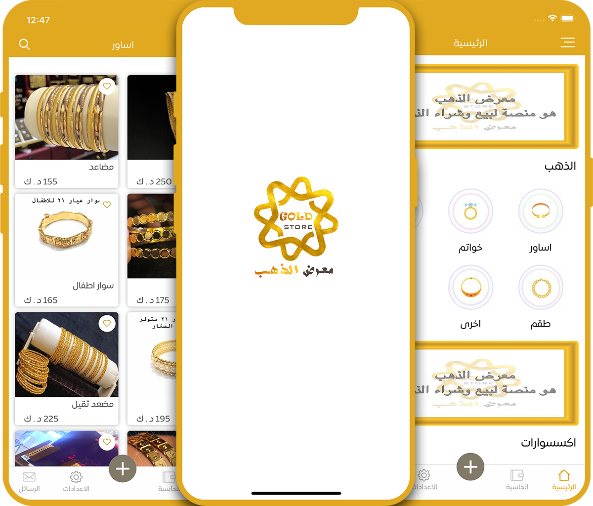

<div align="center">

[](#)
[](https://github.com/abdalla3yash/resala/fork)
[](https://https://github.com/abdalla3yash/resala/issues)
[](#)

</div>


## 💻 Installation steps

- Updated to `Laravel 5.7.*` Now!
- PHP `7.3.4` with Sound Null Safety!

Open CMD where you want to clone the project & run the following commands

```
git clone https://github.com/HussienMaghrabi/goldStore.git
cd goldStore
php artsan serve
php artsan storage:link
```

## 📱 Screen Shots

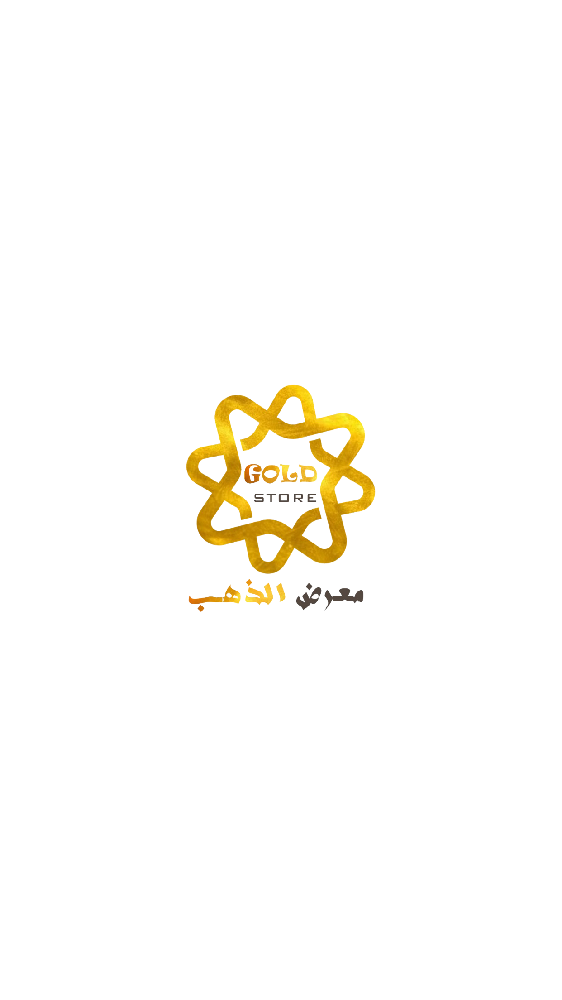 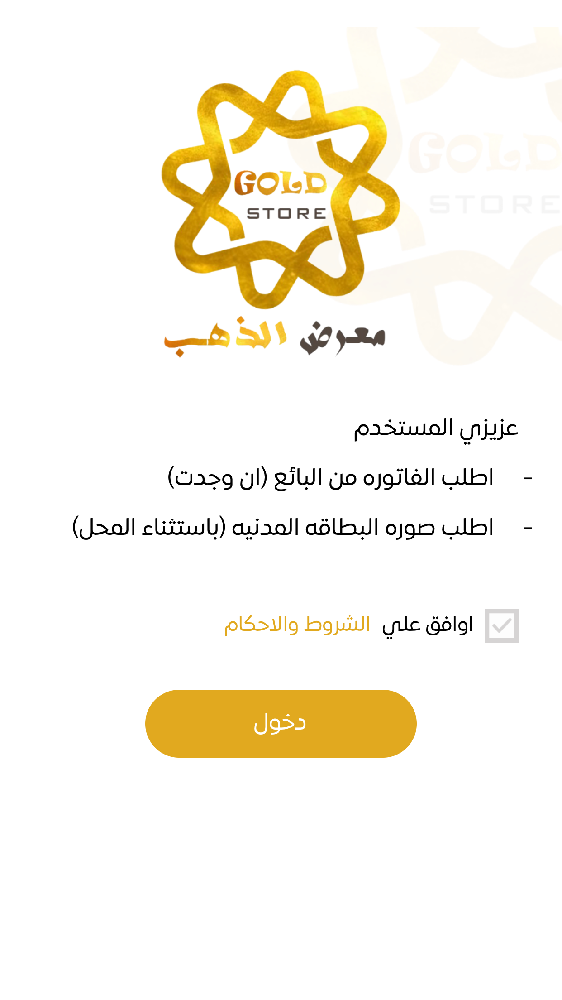 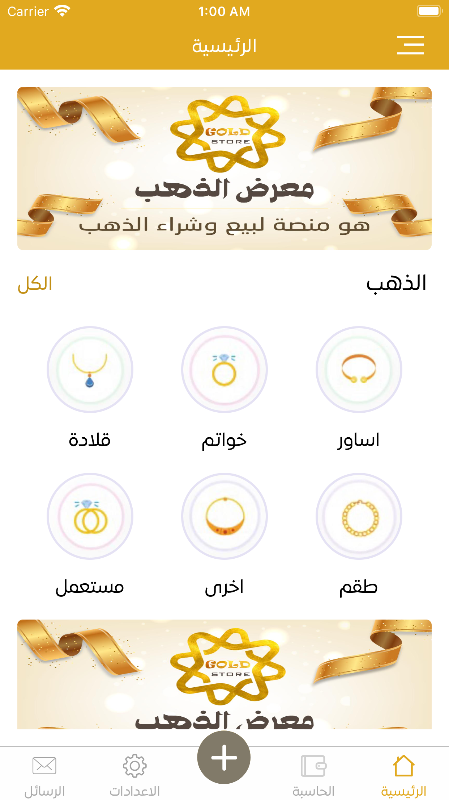 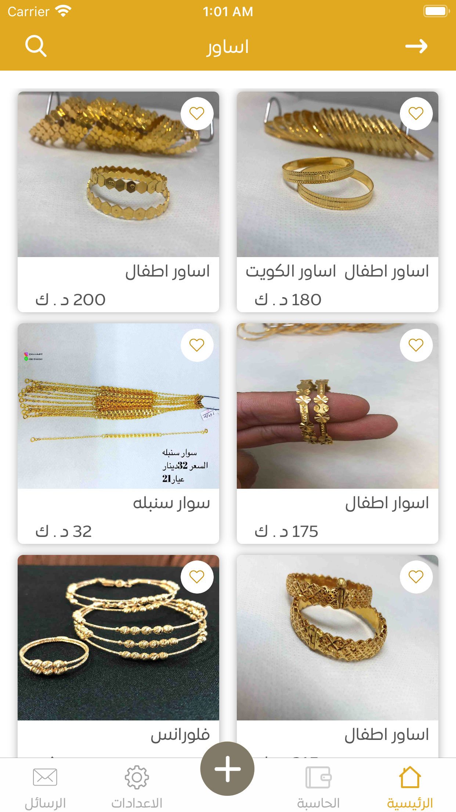 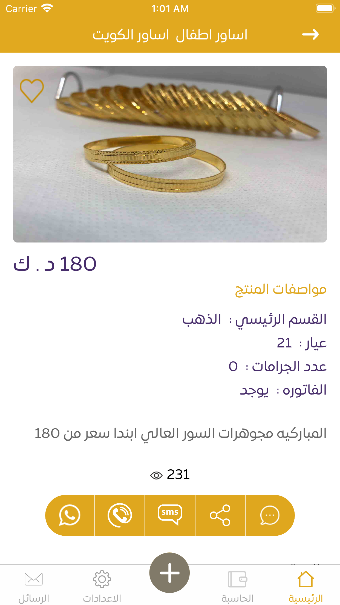 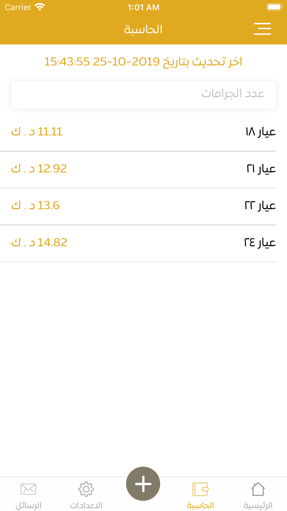 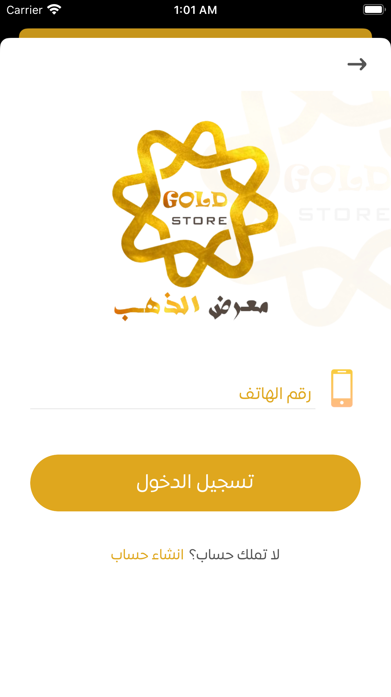 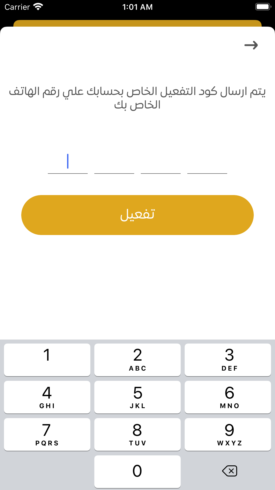 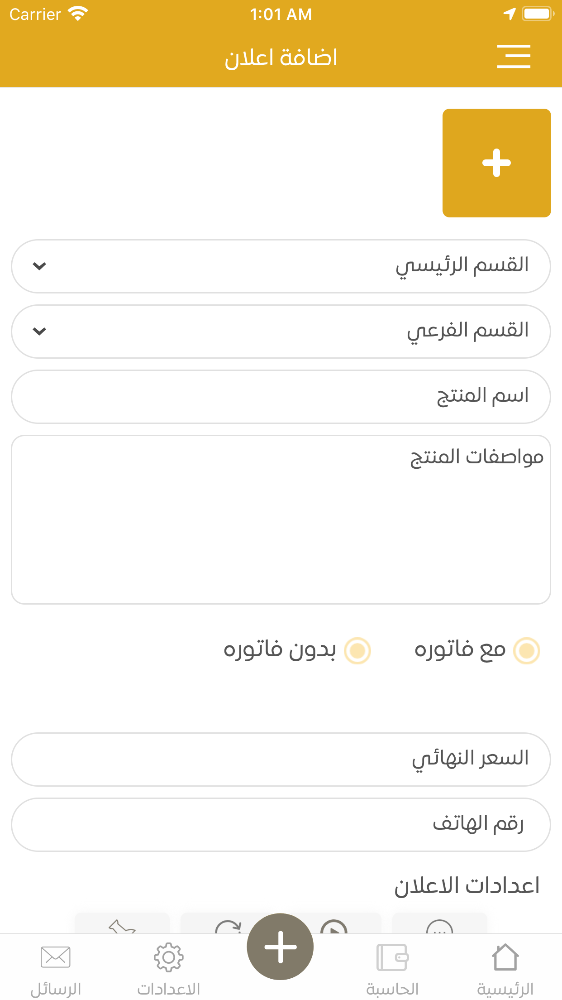 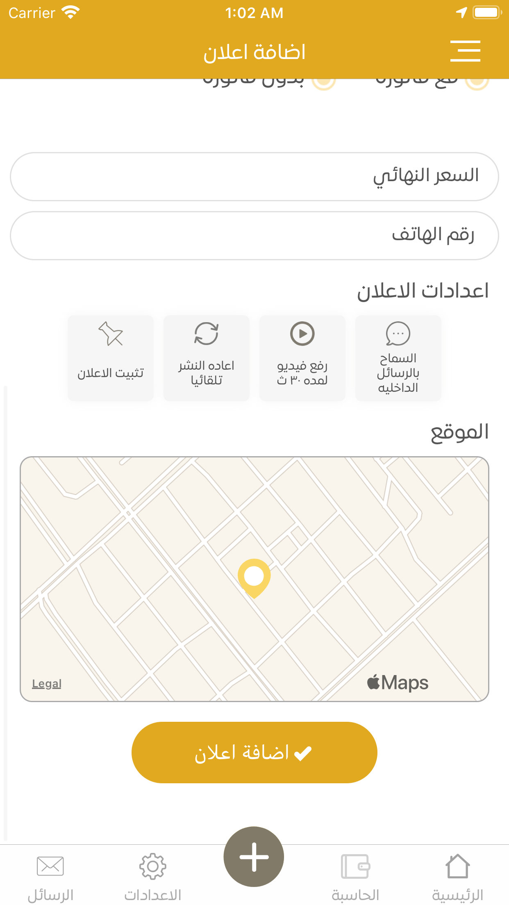 


## 🔗  Information


App: https://play.google.com/store/apps/details?id=com.ValuxApps.GoldStore


## 🧑 Devolper

#### Hussein Maghrabi
[](https://www.linkedin.com/in/hussein-maghrabi/)

You can also follow my GitHub Profile to stay updated about my latest projects:

[](https://github.com/HussienMaghrabi)

If you liked the repo then kindly support it by giving it a star ⭐!

Copyright (c) 2022 Hussein Maghrabi
